# SGI 2023/2024 - TP1

## Group T07G03

| Name             | Number    | E-Mail                    |
| ---------------- | --------- | ------------------------- |
| Fábio Sá         | 202007658 | up202007658@edu.fe.up.pt  |
| Marcos Ferreira  | 201800177 | up201800177@edu.fe.up.pt  |

----

## Tutorials

The tutorials for our classes can be found at the following locations:

- [Tutorial 1](../docs/class1.md)
- [Tutorial 2](../docs/class2.md)
- [Tutorial 3](../docs/class3.md)
- [Tutorial 4](../docs/class4.md)

## Project Information

Our project's objective is to create a THREE.js scene that utilizes simple geometry, curves, transformation, materials, light, and shaders, as taught in our practical classes. The project is inspired by the popular meme "[This is Fine](https://wallpapercave.com/wp/wp7351908.jpg)."

<p align="center">
    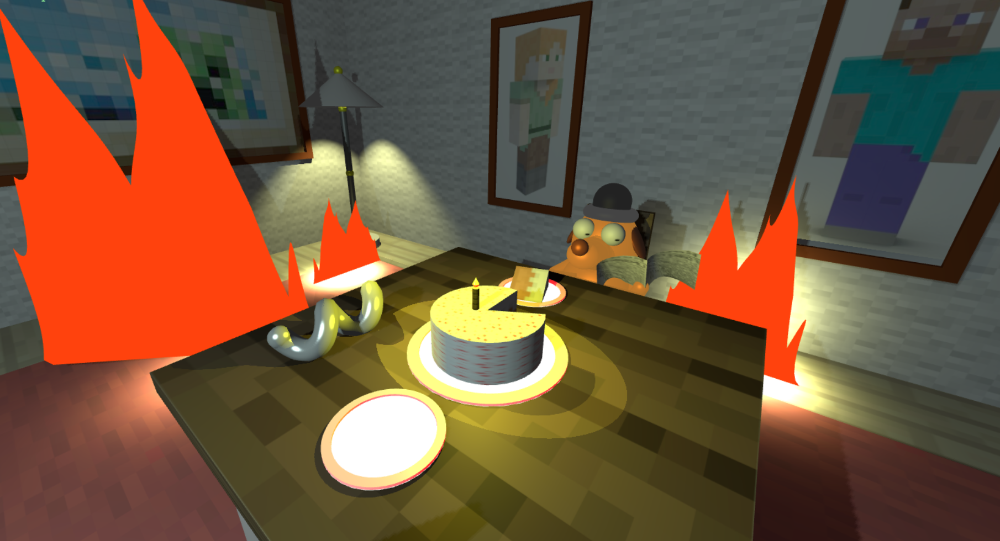
    <p align="center">Figure 1: Project Overview</p>
</p>

## Topics

- [Code Organization](#code-organization)
    - [Objects](#objects)
    - [Utils](#utils)
    - [Additional Context](#additional-context)
- [Controls](#controls)
    - [Main and Camera Controls](#main-and-camera-controls)
    - [Object Controls](#object-controls)
    - [Light Controls](#light-controls)
- [Requirements](#requirements)
    - [Cameras](#cameras)
    - [Floor and Walls](#floor-and-walls)
    - [Table](#table)
    - [Plates](#plates)
    - [Cake](#cake)
    - [Candle](#candle)
    - [Paintings, Window, and Door](#paintings-window-and-door)
    - [Bettle's Painting](#bettle-painting)
    - [Spotlight](#spolight)
    - [Spring](#spring)
    - [Newspaper](#newspaper)
    - [Dog](#dog)
    - [Cartoon Fire](#cartoon-fire)
    - [Jar](#jar)
    - [Flower](#flower)
    - [Shadows](#shadows)
- [Issues and Problems](#issuesproblems)

----

### Code Organization

For the sake of organization and preventing repetitive and disorganized code, we structured our code to enhance development ease and code readability.

#### Objects

The `SceneObject.js` serves as the foundation for modeling other code objects. It includes essential functions required for all objects.

We introduced the concept of a `dependency tree` among scene objects. For example:

> Suppose we have a floor, a table, and a plate.<br>
> If the plate rests on the table and we move the table, we expect the plate to move with it. <br>
> This implies that the plate is dependent on the table (or a sub-object of the table). <br>
> Similarly, the table sits on the floor, making the table a sub-object of the floor. If we move the floor, we expect the table to move.
>
> In this scenario, the `dependency tree` would look something like this:
>
> ```plaintext
> Floor:
>   Table:
>       Plate: ...
> ```

As mentioned earlier, we implemented the concept of `sub-objects` in our base object, stored in an array. Objects can add and remove other objects from this list as needed.

> In our example, to remove the plate from the table and place it on the floor, it becomes a `sub-object` of the floor rather than the table.
>
> To illustrate further, the new `dependency tree` of the scene would appear as follows:
>
> ```plaintext
> Floor:
>   Table:
>   Plate: ...
> ```

#### Utils

Some functionalities required in the project were repetitive or generated complex code. To address these issues and allow for more customization, we created a set of utilities to encompass a wide range of functions.

Here is an overview of the utility functions:

- **CurveUtils.js:** Simplifies the creation of Bezier curves.
- **NurbsUtils.js:** Simplifies the creation of NURBS surfaces and streamlines code organization.
- **RotationUtils.js:** Provides a function to rotate a point in 3D space.
- **ShadowUtils.js:** Simplifies and streamlines the logic of applying shadows to the scene for both objects and light sources.

#### Additional Context

To provide a comprehensive and feature-rich experience, we maintain a list of `sub-objects` outside a `THREE.Group`, stored in an array. This approach allows for moving the master object without affecting the sub-objects dependent on it. In fact, two scenarios are possible:

1. Transforming the master object alone using: `updatePosition`, `updateScale`, `updateRotation`.
2. Transforming both the master object and sub-objects with: `updateAllPosition`, `updateAllScale`, `updateAllRotation`.

These options enable maximum scene customization.

---

### Controls

As previously mentioned, customization is a fundamental requirement for our project. To facilitate this, we've developed a streamlined yet comprehensive system for users to modify the scene.

<p align="center">
    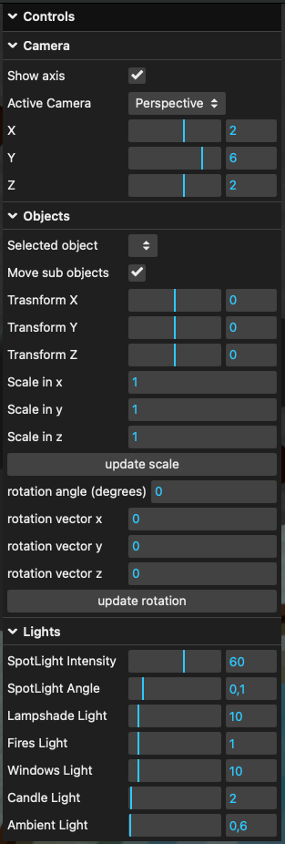
    <p align="center">Figure 2: Controls</p>
</p>

#### Main and Camera Controls

1. Show Axis: You can enable or disable the axis object, allowing it to be shown when needed without interfering with the scene.
2. Camera Perspectives: To simplify camera positioning, we offer different camera perspectives, including:
    1. Perspective
    2. Left View
    3. Top View
    4. Front View
    5. Right View
    6. Back View
3. Camera Coordinates: You can adjust the `x`, `y`, and `z` coordinates of the camera directly from the GUI settings.

#### Object Controls

To maximize customization, we maintain an array of scene objects that can be accessed through GUI controls. This flexibility allows for transforming any object in the scene. The settings available include:

1. List of Objects: We offer a list of available objects.
> **Note:** For objects that cannot be moved individually or can only be moved as a group, only `named` objects are added to the pool of transformable objects. To create a group of objects that can be moved together, create a `SceneObject` with a name and add the objects to the available `THREE.Group`.
2. Move with Sub-Objects: We offer a checkbox for both moving objects alone or moving them along with their dependent sub-objects.

<p align="center">
    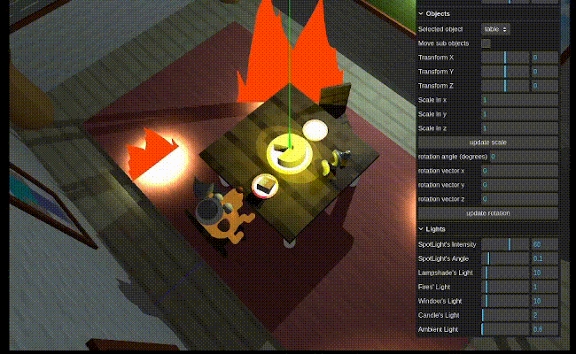
    <p align="center">Figure 3: Moving the Table</p>
</p>

<p align="center">
    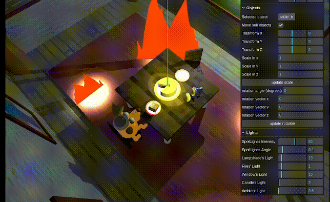
    <p align="center">Figure 4: Moving the Table with all subs</p>
</p>

3. Position: You can adjust object positions using provided sliders.
4. Scale: Object scaling can be modified by changing `x`, `y`, and `z` values separately and then clicking the update button.
5. Rotation: To rotate an object, specify the desired rotation angle (in degrees) and axis coordinates for the rotation.
> The axis is a `THREE.Vector3` defined for the THREE.js function, and rotation is carried out using the object's barycenter, following the default behavior in THREE.js.

#### Light Controls

The scene features various lights, and we provide an interface for adjusting their intensity and aperture angle (where applicable).

1. Spotlight Intensity: We have a `cinemaLight` focused on the cake (by default), and you can modify its intensity using this setting.
2. Spotlight Angle: Control the aperture angle of the `cinemaLight`.
3. Lampshade Light: Adjust the intensity of the lampshade light in the scene.
4. Fire Lights: We've added fire objects with lights in them, and you can control their intensity here.
5. Window Light: We use a point light to simulate the sun in the windows we've added, and you can change its intensity with this setting.
6. Candle Light: Control the intensity of the light in the cake's candle.
7. Ambient Light: Customize the amount of ambient light in the scene.

<p align="center">
    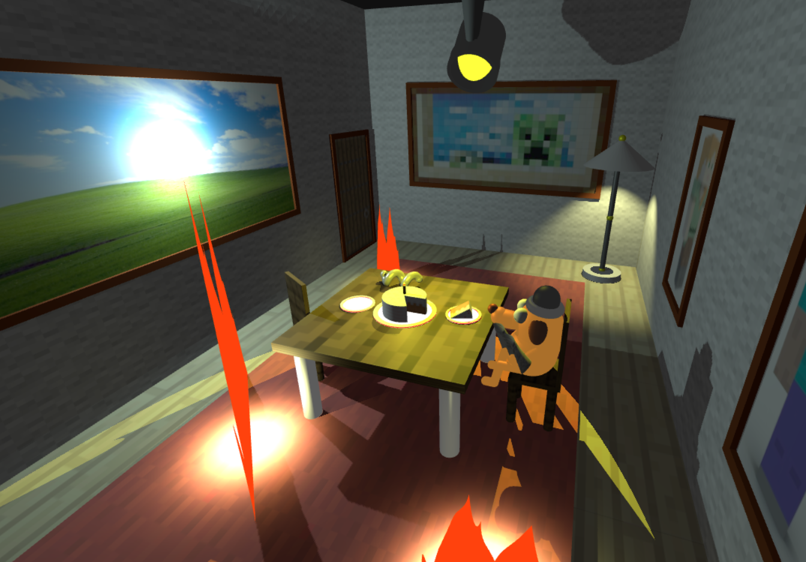
    <p align="center">Figure 5: Cinema Light</p>
</p>

> **Note:** We do not provide options to move the lights, as they are associated with an object. To move a light, please move the associated object.

---

### Requirements

The following sections detail the project's work-related items and their fulfillment.

#### Cameras

For camera control, you can modify the `x`, `y`, and `z` values to reposition the camera. As mentioned earlier, we've also included different predefined camera views for your convenience.

<p align="center">
    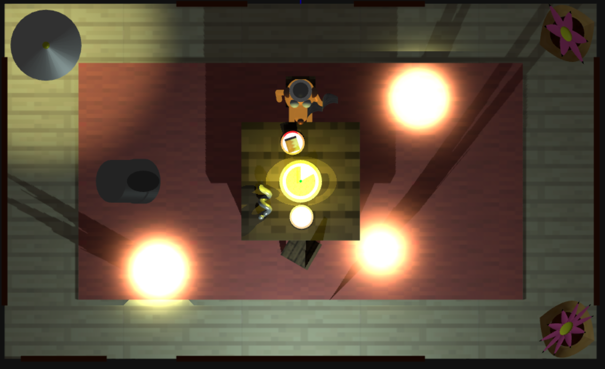
    <p align="center">Figure 6: Top View</p>
</p>

#### Floor and Walls

As required, the walls and the floor are created using planes. However, to improve code organization and facilitate customization, we use a `Surface` object derived from the base `SceneObject`. This approach allows for `sub-objects`, with paintings, windows, doors, and more being dependent on the wall.

<p align="center">
    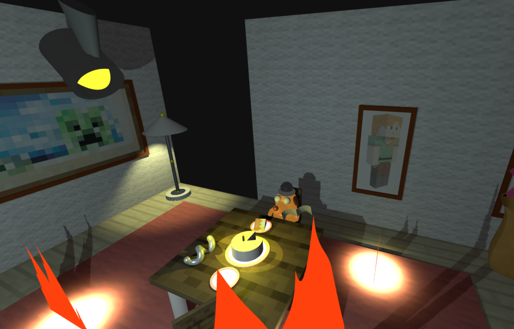
    <p align="center">Figure 7: Moving the wall and its paintings</p>
</p>

Similarly, the floor holds objects and serves as the top of the `dependency tree` described earlier.

#### Table

The table is a simple object composed of a wooden-textured box geometry on top and four cylindrical legs.

<p align="center">
    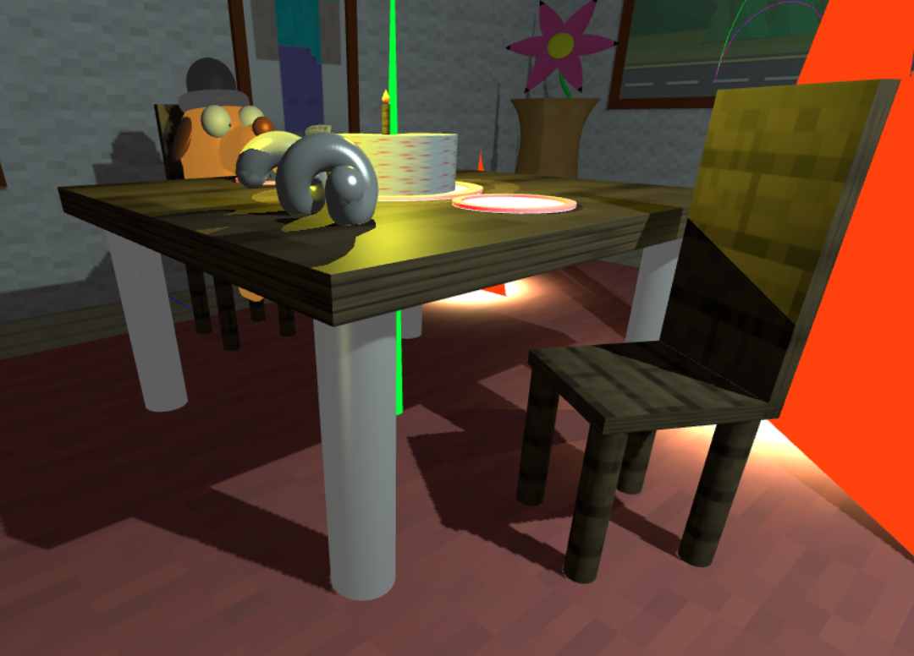
    <p align="center">Figure 8: Table materials</p>
</p>

#### Plates

The plates consist of a cylindrical base and a ring on top to create a border. The ring is essentially made up of two cylinders with different radii. The smaller cylinder is used to create an extrusion on the larger one.

#### Cake

The cake is formed using an incomplete cylinder and two planes to cover the hole. To accommodate a variety of objects in the scene, when creating a `Cake` object, it is filled. This allows for the creation of complete cakes, sliced cakes, and cake pieces, as seen on another plate.

<p align="center">
    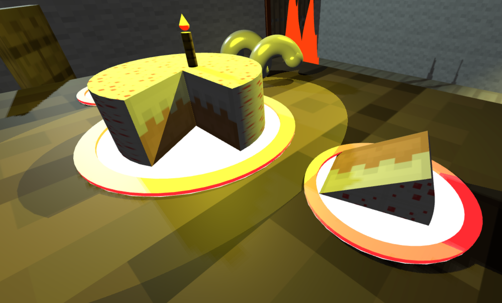
    <p align="center">Figure 9: Delicious cake</p>
</p>

#### Candle

The candle is a simple cylinder with a half-circle and a cone serving as a light object. For added realism and functionality, a weak `PointLight` is placed in the same location where the fire object is meant to be.

#### Paintings, Window, and Door

The paintings, window, and door share the same `Painting` object because they use similar functions and materials. This eliminates the need for redundant code.

<p align="center">
    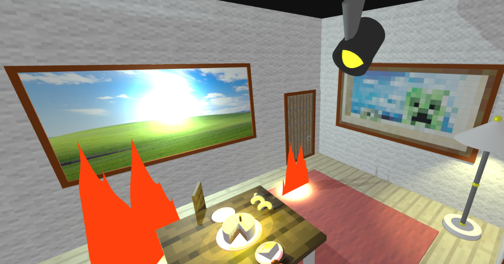
    <p align="center">Figure 10: Paintings and door</p>
</p>

The `Painting` object comprises four `BoxGeometry` frames and a plane used for applying the desired texture.

#### Beetle's Painting

The beetle painting is also created using the `Painting` object. The difference is that a new `CarStructure` object, derived from `SceneObject`, allows us to position the car slightly in front of the painting and add it to the `Painting` object, ensuring it behaves as a single object when considering object dependencies.

<p align="center">
    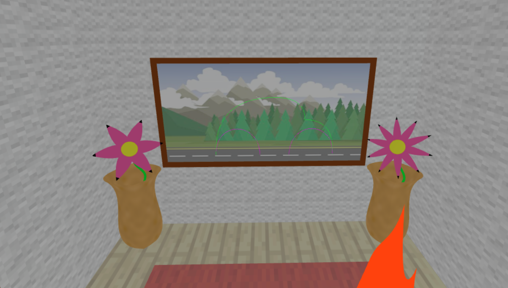
    <p align="center">Figure 11: Beetle</p>
</p>

#### Spotlight

To meet the project requirements, we've added a `Spotlight` pointing at the cake. Instead of leaving the spotlight floating in the scene, we've created a `CinemaLight` object to accompany it, positioned to appear as though it's suspended from the ceiling (although the ceiling itself has not been added to maintain scene visibility).

<p align="center">
    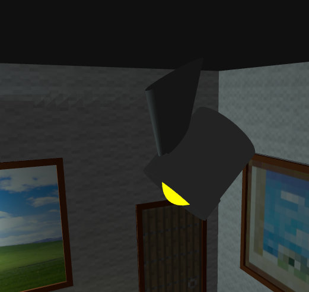
    <p align="center">Figure 12: Cake shadows</p>
</p>

#### Spring

The spring is created by calculating a path with a spiral function, and a `CatMullCurve` is used in a `TubeGeometry` to give it shape. To close the ends of the spring, two spheres are added. This approach creates a customizable object with actual volume, allowing for thickness definition when creating a new spring.

<p align="center">
    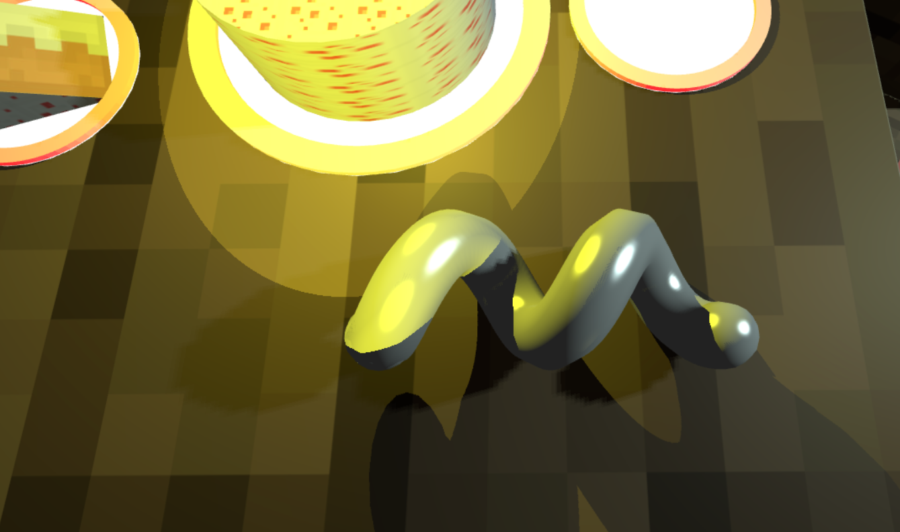
    <p align="center">Figure 13: Spring</p>
</p>

#### Newspaper

As required, the newspaper is designed to resemble a half-cane. We've gone a step further by creating two pages side by side to achieve a realistic newspaper look.

<p align="center">
    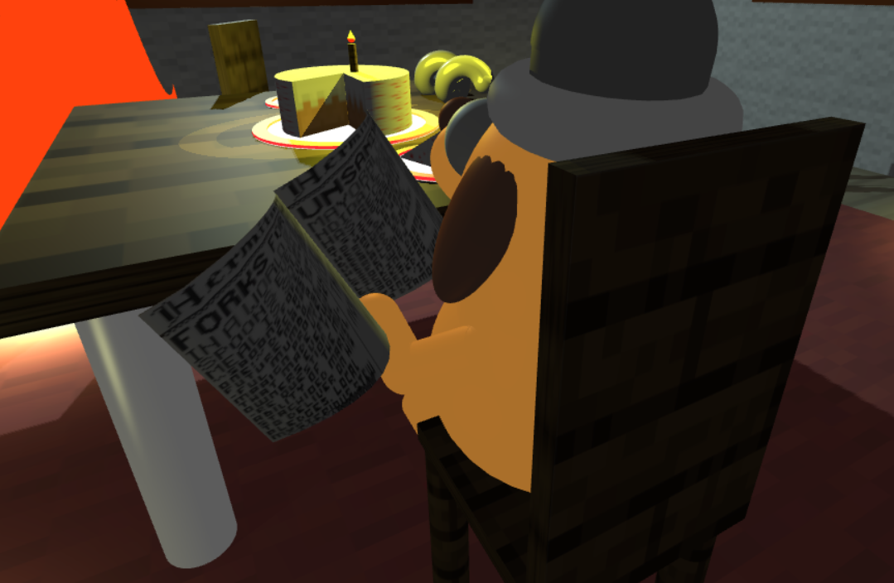
    <p align="center">Figure 14: Newspaper</p>
</p>

For added fun and to fit the scene's context, the dog in our project is depicted reading the newspaper.

#### Dog

To recreate the "This is Fine" meme, we've modeled the dog, which is one of the more complex objects in our project. It consists of different parts that come together to create the final look.

<p align="center">
    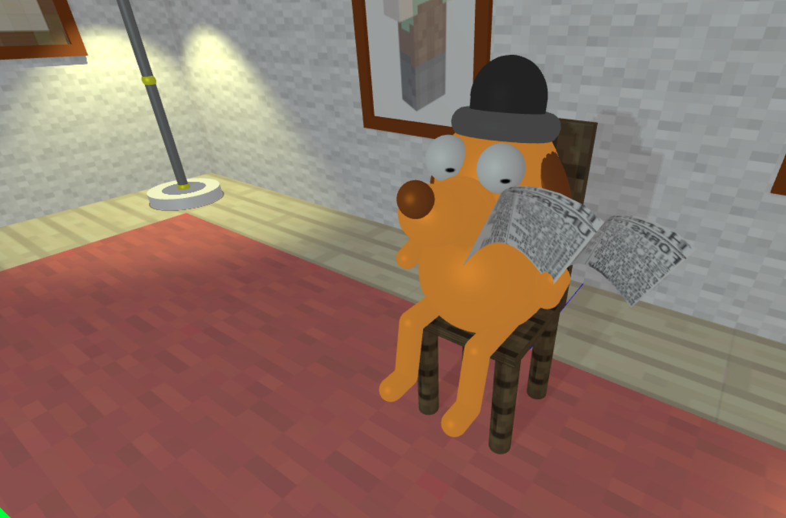
    <p align="center">Figure 15: Dog</p>
</p>

All the objects used to model the dog can be found in the `dog` folder within the `objects` directory.

#### Cartoon Fire

To complete the meme, we needed to include fire. The fire is a 2D object primarily composed of Bezier curves.

<p align="center">
    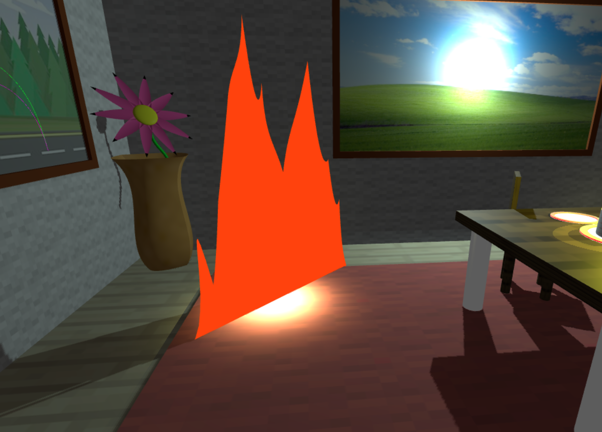
    <p align="center">Figure 16: Cartoon fire</p>
</p>

The fire also incorporates a `PointLight` to simulate light generation.

#### Jar

As stipulated, the jar is created using two NURBS surfaces combined to form the jar. We've also added a circular plane at the bottom in case someone decides to move it. Although it has some minor issues, they do not significantly impact functionality (see [Issues/Problems](#issuesproblems)).

<p align="center">
    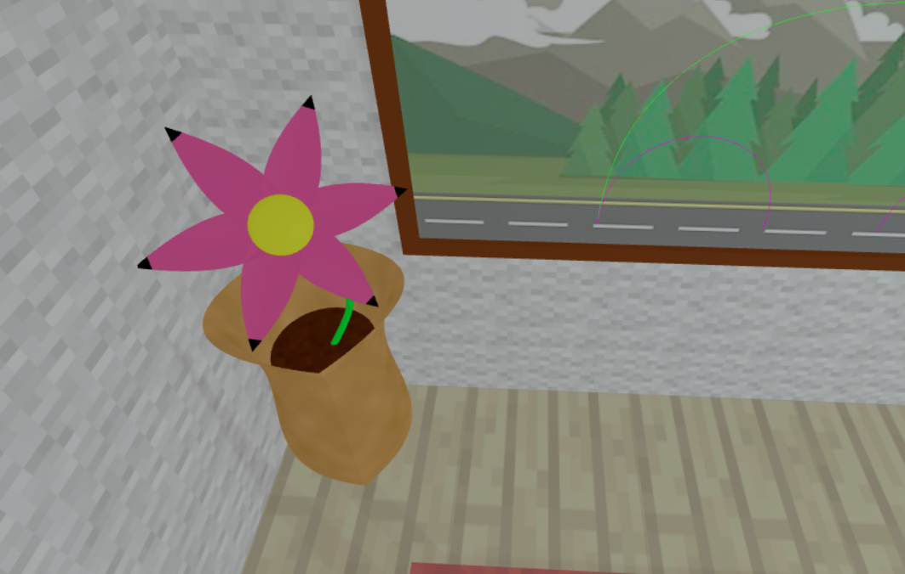
    <p align="center">Figure 17: Jar and flower</p>
</p>

We've also included a circular plane with a dirt texture to prevent the flower from appearing as if it's floating.

#### Flower

The flower is generated using a `CatMullCurve` from a path geometry, similar to the spring. The stem is created using tube geometry, while the flower's disk is formed from a flattened sphere. The petals are designed using NURBS to achieve a petal-like appearance.

To enhance customization, you can define several variables for the flower, including stem length, petal count, disk size, and more.

<p align="center">
    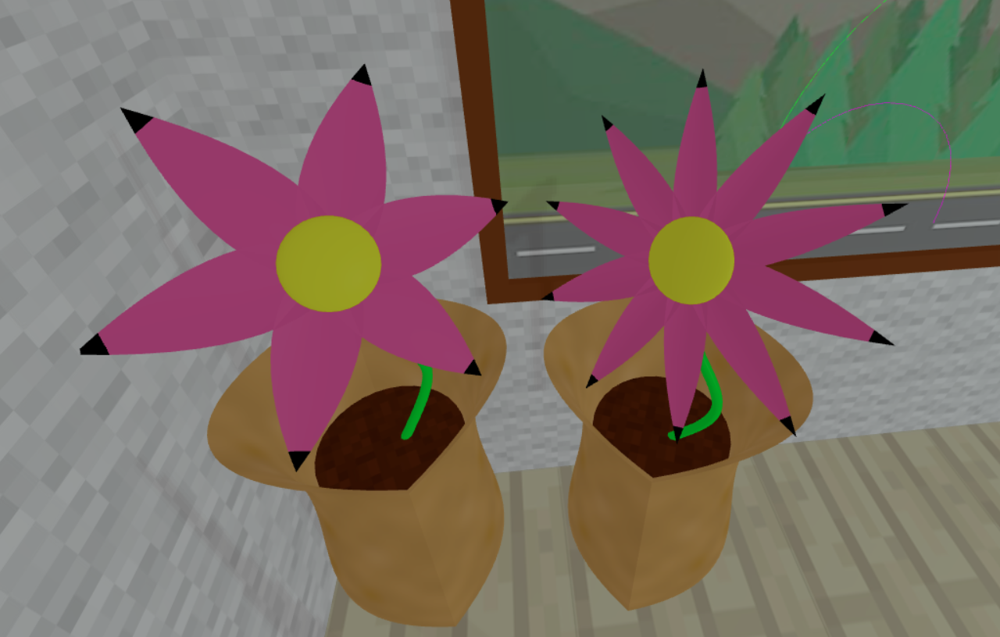
    <p align="center">Figure 18: Flower</p>
</p>

Complete details can be found in `Flower.js`.

#### Shadows

Shadows have been applied to most objects in the scene, enhancing the scene's dynamic qualities. As required, the spotlight casts a shadow of the cake on the table. The scene also features various lights and shadows, creating an engaging interplay between objects and the shadows they cast.

<p align="center">
    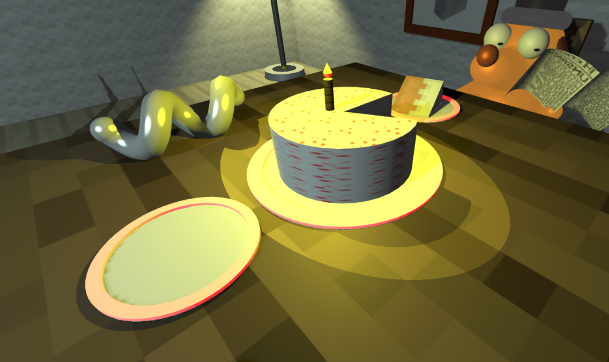
    <p align="center">Figure 19: Cake shadows</p>
</p>

It's worth noting that the shadow of the cake on the table is not as intense as the spotlight would suggest, owing to the presence of the candle's light. This demonstrates the level of detail and realism shadows add to the scene.

## Issues/Problems

- The appearance of dirt in the jars (or vase) may not be perfect since the jar has points. NURBS surfaces may not remain perfectly round unless numerous points are added.

<p align="center">
    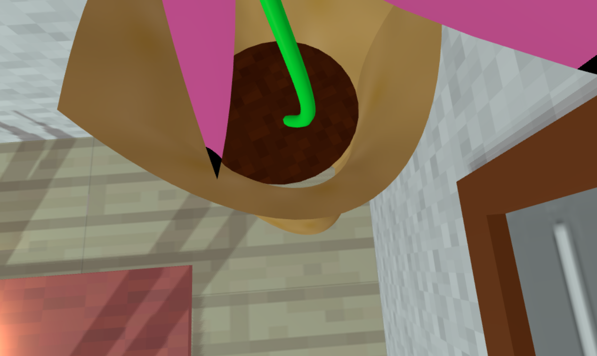
    <p align="center">Figure 20: Dirt in jar</p>
</p>
