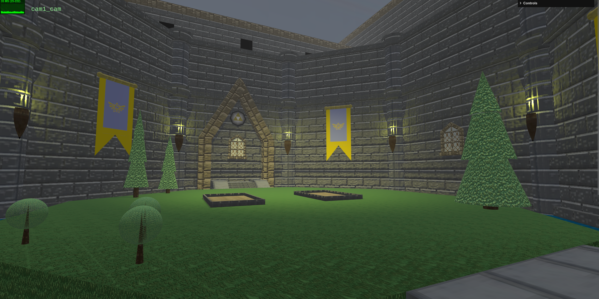
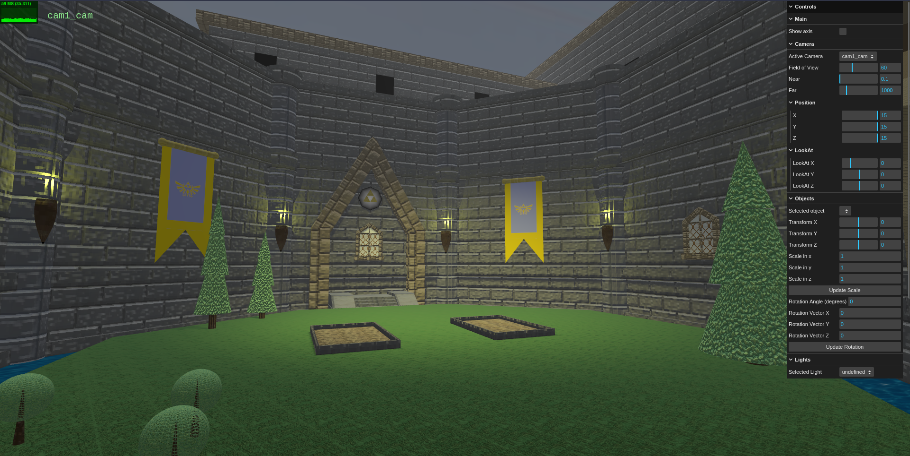
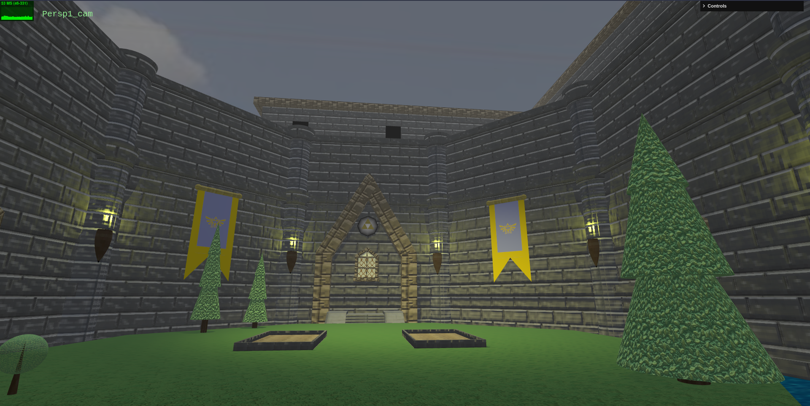

# SGI 2023/2024 - TP2

## Group T07G03

| Name            | Number    | E-Mail                   |
| --------------- | --------- | ------------------------ |
| Fábio Sá        | 202007658 | up202007658@edu.fe.up.pt |
| Marcos Ferreira | 201800177 | up201800177@edu.fe.up.pt |

---

## Project Information

Our project's objective was to create a THREE.js scene based on a parser (given) and a configuration file.

The inspiration for the project was the `Castle Courtyard` from the game `The Legend of Zelda Ocarina of Time`. The main reference image used was (We also used references from remakes made later, however the main inspiration was recreating the `N64` version with our own touch).

Inspiration:


The end results was:



More photos can be seen in the end.

## Topics

#### Code Organization

- [Loaders](#loaders)
  - [Camera Loader](#camera-loader)
  - [Light Loader](#light-loader)
  - [Material Loader](#material-loader)
  - [Object Loader](#object-loader)
  - [Skybox Loader](#skybox-loader)
  - [Texture Loader](#texture-loader)
- [Objects](#objects)
  - [SceneObject](#sceneobject)
  - [Triangle](#triangle)
  - [Polygon](#polygon)
- [Parser](#parser)
- [Scenes](#scenes)
- [Utils](#utils)
  - [CurveUtils](#curveutils)
  - [NurbsBuilder](#nurbsbuilder)
  - [NurbSurfaceUtils](#nurbsurfaceutils)
  - [ShadowUtils](#shadowutils)

#### Controls

- [Main Controls](#main-controls)
- [Camera Controls](#camera-controls)
  - [Perspective Camera](#perspective-camera-controls)
  - [Orthographic Camera](#orthographic-camera-controls)
- [Object Controls](#object-controls)
- [Lights](#light-controls)
  - [Ambient Light](#ambient-light-controls)
  - [Point Light](#point-light-controls)
  - [Spotlight](#spot-light-controls)
  - [Directional Light](#directional-light-controls)

#### Other

- [Checklist](#checklist)
- [Example Photos](#exampe-photos)
- [Notes](#notes)

## Code Organization

To make it easier to understand what the code does and keep the organization of the project, the project is divided into different folders, where each represent a `category`:

    ├── loaders
    ├── objects
    ├── parser
    ├── scenes
    ├── utils
    └── ...

### Loaders

`Loaders` are responsible for creating the different types of objects in the project. While parser gives us the information semi-organized, a loader is responsible to further breakdown until it can be fully used to create an object.

A loader also deals with the default configurations ans ensure if nothing is given a default option will be shown.

**OBS:** Loaders, in some situations, assume that the images given by the parser is valid.

#### Loaders Avalilable

1. Camera Loader
   <a id="camera-loader"></a>

---

- **Module**: `CameraLoader.js`
- **Purpose**: Responsible for getting the information about a camera and creating it.
- **Method**:
  - `load(cameraData)`: Loads cameras based on an array of camera objects.
    - Supports "orthogonal" and "perspective" camera types.
    - Creates Three.js camera objects with specified parameters.
    - Logs an error and skips unknown camera types.
    - Returns an array of camera objects for the scene.
    - If no valid cameras provided, creates a default perspective camera.
- **Camera Properties**:
  - Position, target, custom data.
- **Usage Example**:

  ```js
  import { cameraLoader } from "CameraLoader.js";

  const cameras = cameraLoader.load(cameraData);
  ```

2. Light Loader
   <a id="light-loader"></a>

---

- **Module**: `lightLoader.js`
- **Purpose**: Provides functions to load and set up lights given parser data.
- **Method**:
  - `load(light)`: Load a light based on the provided light object.
    - Supports pointlight, spotlight, and directionallight types.
    - Creates Three.js light objects with specified parameters.
    - Adds additional elements like light target for spotlight.
    - Wraps the light object in a SceneObject for organization.
    - Returns the light object wrapped in a SceneObject.
- **Light Types**:
  - `pointlight`: Point light source with distance and decay properties.
  - `spotlight`: Spotlight with distance, angle, decay, penumbra, and optional target.
  - `directionallight`: Directional light with shadow camera properties.
- **Light Object Properties**:
  - Enabled, color, intensity, position, castShadow, shadow properties.
- **Usage Example**:

  ```js
  import { lightLoader } from "lightLoader.js";

  const lightObject = lightLoader.load(lightData);
  ```

3. Material Loader
   <a id="material-loader"></a>

---

- **Module**: `MaterialLoader.js`
- **Purpose**: Provides functions to load and set up materials.
- **Methods**:
  - `getMatDetails(materialData, textureMap)`: Load materials based on an object containing material data.
    - Returns a map of loaded materials information, where keys are material IDs.
  - `create(materialInfo, sizeX = 1, sizeY = 1)`: Create a THREE.Material with texture.
    - Supports MeshPhongMaterial and MeshStandardMaterial.
    - Applies color, specular, shininess, emissive, wireframe, and other properties.
    - Supports regular textures, video textures, and mipmaps.
- **Usage Example**:

  ```javascript
  import { materialLoader } from "MaterialLoader.js";

  const materialMap = materialLoader.getMatDetails(materialData, textureMap);
  const materialObject = materialLoader.create(materialInfo, sizeX, sizeY);
  ```

4. Object Loader
   <a id="object-loader"></a>

---

- **Module**: `ObjectLoader.js`
- **Puporse**: Provides functions to load and set up objects in the scene, including nodes, LODs, primitives, lights, etc.
- **Methods**:

  > 1.  **load(objectData, rootId, materialMap)**
  >
  > - _Description_: Loads objects based on an object containing object data.
  > - _Parameters_:
  >   - `objectData` (Object): Object with information to load the objects.
  >   - `rootId` (String): The ID of the root object.
  >   - `materialMap` (Map<String, THREE.Object3D>): A map of materials.
  > - _Returns_: Main node to add to the objects.
  >
  > 2.  **createPrimitive(primitive, materialId, castShadow=false, receiveShadow=false)**
  >
  > - _Description_: Creates a primitive object based on primitive data.
  > - _Parameters_:
  >   - `primitive` (Object): Primitive data.
  >   - `materialId` (String): Material to be applied.
  >   - `castShadow` (Boolean): If the primitive casts shadows onto other objects (default: false).
  >   - `receiveShadow` (Boolean): If the primitive receives shadows from other objects (default: false).
  > - _Returns_: THREE.Mesh: A primitive object.
  >
  > 3.  **parseNode(node)**
  >
  > - _Description_: Parses a node and its children to create a hierarchical object structure.
  > - _Parameters_: `node` (Object): The node to parse.
  > - _Returns_: SceneObject: The parsed object structure.
  >
  > 4.  **transform(object, transformations)**
  >
  > - _Description_: Applies transformations to the given object based on the provided transformation parameters.
  > - _Parameters_:
  >   - `object` (THREE.Object3D): The 3D object to be transformed.
  >   - `transformations` (Object): Transformation parameters.
  > - _Returns_: void
  >
  > 5.  **getMaterials(node, materialList)**
  >
  > - _Description_: Retrieves the list of materials associated with a node and returns the material IDs.
  > - _Parameters_:
  >   - `node` (Object): The node containing material information.
  >   - `materialList` (Array): The list of available materials.
  > - _Returns_: [Array, String]: An array containing the material IDs and the default material ID.
  >
  > 6.  **updateCloneNames(cloneChild, newFatherName)**
  >
  > - _Description_: Updates the names of cloned objects and their descendants based on the new father's name.
  > - _Parameters_:
  >   - `cloneChild` (THREE.Object3D): The cloned object whose name needs to be updated.
  >   - `newFatherName` (String): The new name of the father object.
  > - _Returns_: void
  >
  > 7.  **getRectangle(parameters, materialData, material)**
  >
  > - _Description_: Generates a rectangle mesh based on the provided parameters.
  > - _Parameters_:
  >   - `parameters` (Object): Rectangle parameters.
  >   - `materialData` (Object): Material data for creating the material.
  >   - `material` (THREE.Material): Optional material to use.
  > - _Returns_: THREE.Mesh: The generated rectangle mesh.
  >
  > 8.  **getTriangle(parameters, materialData, material)**
  >
  > - _Description_: Generates a triangle mesh based on the provided parameters.
  > - _Parameters_:
  >   - `parameters` (Object): Triangle parameters.
  >   - `materialData` (Object): Material data for creating the material.
  >   - `material` (THREE.Material): Optional material to use.
  > - _Returns_: THREE.Mesh: The generated triangle mesh.
  >
  > 9.  **getCylinder(parameters, materialData)**
  >
  > - _Description_: Generates a cylinder mesh based on the provided parameters.
  > - _Parameters_:
  >   - `parameters` (Object): Cylinder parameters.
  >   - `materialData` (Object): Material data for creating the material.
  > - _Returns_: THREE.Mesh: The generated cylinder mesh.
  >
  > 10. **getBox(parameters, materialData)**
  >
  > - _Description_: Generates a box mesh based on the provided parameters.
  > - _Parameters_:
  >   - `parameters` (Object): Box parameters.
  >   - `materialData` (Object): Material data for creating the material.
  > - _Returns_: THREE.Mesh: The generated box mesh.
  >
  > 11. **getNurbs(parameters, materialData, material)**
  >
  > - _Description_: Generates a NURBS surface mesh based on the provided parameters.
  > - _Parameters_:
  >   - `parameters` (Object): NURBS parameters.
  >   - `materialData` (Object): Material data for creating the material.
  >   - `material` (THREE.Material): Optional material to use.
  > - _Returns_: THREE.Mesh: The generated NURBS mesh.
  >
  > 12. **getSphere(parameters, materialData, material)**
  >
  > - _Description_: Generates a sphere mesh based on the provided parameters.
  > - _Parameters_:
  >   - `parameters` (Object): Sphere parameters.
  >   - `materialData` (Object): Material data for creating the material.
  >   - `material` (THREE.Material): Optional material to use.
  > - _Returns_: THREE.Mesh: The generated sphere mesh.
  >
  > 13. **getPolygon(parameters)**
  >
  > - _Description_: Generates a polygon mesh based on the provided parameters.
  > - _Parameters_: `parameters` (Object): Polygon parameters.
  > - _Returns_: THREE.Mesh: The generated polygon mesh.

- **Usage Example**:

  ```js
  import { objectLoader } from "ObjectLoader.js";

  const mainNode = objectLoader.load(objectData, rootId, materialMap);
  scene.add(mainNode);
  // Other functions are mainly for internal usage
  ```

5. Skybox Loader
   <a id="skybox-loader"></a>

---

- **Module**: `SkyBoxLoader.js`
- **Purpose**: Provides a function to load a background image and create a skybox.
- **Method**:
  - `load(skyboxesData)`: Loads and creates a skybox based on the provided skyboxes data.
    - Supports an array of skyboxes data.
    - Creates a THREE.Mesh skybox using BoxGeometry and multiple textures.
    - Uses MeshStandardMaterial for each face with emissive properties.
    - Returns the created skybox as a THREE.Mesh.
- **Usage Example**:

  ```js
  import { skyboxLoader } from "SkyBoxLoader.js";

  const skybox = skyboxLoader.load(skyboxesData);
  scene.add(skybox);
  ```

6. Texture Loader
   <a id="texture-loader"></a>

---

- **Module**: `TextureLoader.js`
- **Purpose**: Provides functions to get information about textures.
- **Methods**:
  - `getTexPaths(textureData)`: Load textures based on an object containing texture data.
    - Returns a map of loaded textures, where keys are texture IDs.
  - `create(textureInfo)`: Create a THREE.Texture object based on texture information.
  - `loadMipmap(parentTexture, level, path)`: Load an image and create a mipmap to be added to a texture at the defined level.
    - Uses the THREE.TextureLoader to load the mipmap image.
    - Draws the mipmap image onto a canvas and adds it to the parent texture at the specified level.
- **Usage Example**:

  ```js
  import { textureLoaderC } from "TextureLoader.js";

  const textureMap = textureLoaderC.getTexPaths(textureData);
  const textureObject = textureLoaderC.create(textureInfo);
  textureLoaderC.loadMipmap(parentTexture, level, path);
  ```

### Objects

#### sceneObject

- **Module**: `SceneObject.js`
- **Purpose**: It extends group and its main function is to help the creation of the objects. It does not have many functionalities, however it came from previous work and keeping its implementation was easier.
- **Description**:
  - This class, `SceneObject`, extends the THREE.Group class from the Three.js library.
  - The object includes a name, which is displayed on the side menu, and a material ID for the items inside.

#### Triangle

The `Triangle.js` module provides functionality to create a triangle using BufferGeometry in Three.js. It defines a class, `Triangle`, with a constructor that takes coordinates for three vertices (`x1`, `y1`, `x2`, `y2`, `x3`, `y3`) and optional texture coordinates (`afs` and `aft`). The `initBuffers()` method initializes buffers for a triangle mesh, including position, normals, and texture coordinates.

- **Usage Example**:

  ```js
  import { Triangle } from "Triangle.js";

  const triangleCoordinates = [
    [x1, y1, z1],
    [x2, y2, z2],
    [x3, y3, z3],
  ];

  const triangle = new Triangle(triangleCoordinates, afs, aft);
  scene.add(triangle);
  ```

#### Polygon

The `Polygon.js` module provides functionality to create a polygon with an arbitrary number of vertices using BufferGeometry in Three.js. The `Polygon` class, defined in this module, takes parameters such as `radius`, `stacks`, `slices`, `color_c`, and `color_p` to customize the geometry and color of the polygon.

- **Technical Notes**:

  - The `initBuffers()` method constructs the geometry based on the specified number of stacks and slices, creating a shape with interpolated colors.
  - The `getColor(stack)` method calculates the interpolated color at a given stack position.
  - The geometry is created in a radial pattern, forming a polygon with specified slices and stacks.

- **Usage example**:

  ```js
  import * as THREE from "three";
  import { Polygon } from "Polygon.js";

  // Create a new Polygon geometry
  const radius = 5;
  const stacks = 8;
  const slices = 16;
  const color_c = new THREE.Color(0xff0000); // Red
  const color_p = new THREE.Color(0x0000ff); // Blue

  const polygonGeometry = new Polygon(radius, stacks, slices, color_c, color_p);

  // Create a mesh using the geometry
  const material = new THREE.MeshBasicMaterial({
    vertexColors: THREE.VertexColors,
  });
  const polygonMesh = new THREE.Mesh(polygonGeometry, material);

  // Add the mesh to the scene
  scene.add(polygonMesh);
  ```

### Parser

Since the `parser` was build by the professors and not modified by us in any way we will not be commenting on it.

### Scenes

Contains the folder for different scenes.

For our scene the file structure looks like this:

    ./scenes/
    └── SGI_TP2_XML_T07_G03_v02
        ├── bumpTextures
        ├── skybox
        ├── specialTextures
        ├── textures
        │   └── doorMipMaps
        ├── videos
        └── SGI_TP2_XML_T07_G03_v02.xml

- **Scene Details**:

  - **bumpTextures:** Folder containing bump textures.
  - **skybox:** Folder for skybox-related assets.
  - **specialTextures:** Folder for textures with special properties.
  - **textures:** Main folder for regular textures.
  - **doorMipMaps:** Subfolder specifically for door textures with mipmaps.
  - **videos:** Folder for video assets.
  - **SGI_TP2_XML_T07_G03_v02.xml:** Scene configuration file.

- **Notes**:

  - Textures are in `jpg` format, and each folder corresponds to a specific type of texture.
  - Not all textures have associated bump maps or special textures.
  - A door with mipmaps has been implemented as part of the scene requirement (the only door in the scene).

### Utils

We utilized the utils from the previous project as such it contains functions which were not used, but the overall utilization helped reduce the complexity of the code and abstract concepts into easy to use functions.

- **Module:** `CurveUtils.js`
  <a id="curveutils"></a>

  - **Purpose**: Provides functions to assist in the creation of Bezier curves.
  - **Methods**:

    - `drawHull(position, points)`: Draw a convex hull for a set of points.
    - Parameters:
      - `position`: The position for the convex hull.
      - `points`: The array of points for the convex hull.
    - Returns: `THREE.Line` representing the convex hull.

    - `quadraticBezierCurve(x, y, z, points, numberOfSamples)`: Create a quadratic Bezier curve.
    - Parameters:
      - `x`, `y`, `z`: Coordinates of the curve's position.
      - `points`: The control points for the curve.
      - `numberOfSamples`: The number of points to sample on the curve.
    - Returns: `THREE.Line` representing the quadratic Bezier curve.

    - `cubicBezierCurve(x, y, z, points, numberOfSamples)`: Create a cubic Bezier curve.
    - Parameters:
      - `x`, `y`, `z`: Coordinates of the curve's position.
      - `points`: The control points for the curve.
      - `numberOfSamples`: The number of points to sample on the curve.
    - Returns: `THREE.Line` representing the cubic Bezier curve.

    - `quadraticBezierCurveGeometry(points, divisions)`: Create a geometry for a quadratic Bezier curve.
    - Parameters:
      - `points`: The control points for the curve.
      - `divisions`: The number of divisions for the curve.
    - Returns: `THREE.BufferGeometry` for the quadratic Bezier curve.

    - `cubicBezierCurveGeometry(points, divisions)`: Create a geometry for a cubic Bezier curve.
    - Parameters:
      - `points`: The control points for the curve.
      - `divisions`: The number of divisions for the curve.
    - Returns: `THREE.BufferGeometry` for the cubic Bezier curve.

  - **Usage Example**:

    ```js
    import { curveGenerator } from "CurveUtils.js";

    const hullLine = curveGenerator.drawHull(position, points);
    const quadraticCurve = curveGenerator.quadraticBezierCurve(
      x,
      y,
      z,
      controlPoints,
      numberOfSamples
    );
    const cubicCurve = curveGenerator.cubicBezierCurve(
      x,
      y,
      z,
      controlPoints,
      numberOfSamples
    );
    const quadraticGeometry = curveGenerator.quadraticBezierCurveGeometry(
      controlPoints,
      divisions
    );
    const cubicGeometry = curveGenerator.cubicBezierCurveGeometry(
      controlPoints,
      divisions
    );
    ```

- **Module**: `NurbsBuilder.js`
  <a id="nurbsbuilder"></a>

  - **Purpose**: Responsible for the creation of NURBS (Non-Uniform Rational B-Splines) surfaces.
  - **Constructor**:

    - `constructor(app)`: Constructs a NurbsBuilder object.
    - Parameters:
      - `app`: The application object.

  - **Methods**:

    - `build(controlPoints, degree1, degree2, samples1, samples2, material)`: Build a NURBS surface geometry.
    - Parameters:
      - `controlPoints`: Control points for the NURBS surface.
      - `degree1`: The degree in the U direction.
      - `degree2`: The degree in the V direction.
      - `samples1`: Number of samples in the U direction.
      - `samples2`: Number of samples in the V direction.
      - `material`: The material for the geometry.
    - Returns: `THREE.Geometry` representing the NURBS surface.

  - **Usage Example** (usually used inside the utils only):

    ```js
    import { NurbsBuilder } from "NurbsBuilder.js";

    const app = // your app initialization
    const nurbsBuilder = new NurbsBuilder(app);

    const controlPoints = // define control points
    const degree1 = // define degree in U direction
    const degree2 = // define degree in V direction
    const samples1 = // define number of samples in U direction
    const samples2 = // define number of samples in V direction
    const material = // define material

    const nurbsGeometry = nurbsBuilder.build(controlPoints, degree1, degree2, samples1, samples2, material);
    ```

- **Module**: `NurbsSurfaceUtils.js`
  <a id="nurbsurfaceutils"></a>

  - **Purpose**: Provides functions to aid in the creation of NURBS (Non-Uniform Rational B-Splines) surfaces.
  - **Methods**:

    - `parseNurbs(parameters, material)`: Parse NURBS data from an XML node and create a NURBS surface.
    - Parameters:
      - `parameters`: An object containing the following properties:
      - `degree_u`: The degree in the U direction.
      - `degree_v`: The degree in the V direction.
      - `parts_u`: Number of parts in the U direction.
      - `parts_v`: Number of parts in the V direction.
      - `controlpoints`: Array of control points data.
      - `material`: The material to apply to the NURBS surface.
    - Returns: `THREE.Mesh` representing the NURBS surface.

    - `createNurbsSurfaces(x, y, z, controlPoints, orderU, orderV, samplesU, samplesV, material)`: Create a NURBS surface.
    - Parameters:
      - `x`, `y`, `z`: Coordinates of the surface's position.
      - `controlPoints`: Control points for the NURBS surface.
      - `orderU`: The order in the U direction.
      - `orderV`: The order in the V direction.
      - `samplesU`: Number of samples in the U direction (default is 10).
      - `samplesV`: Number of samples in the V direction (default is 10).
      - `material`: The material for the geometry.
    - Returns: `THREE.Mesh` representing the NURBS surface.

    - `createDoubleSidedNurbsSurfaces(x, y, z, controlPoints, orderU, orderV, samplesU, samplesV, material)`: Create a double-sided NURBS surface.
    - Parameters:
      - `x`, `y`, `z`: Coordinates of the surface's position.
      - `controlPoints`: Control points for the NURBS surface.
      - `orderU`: The order in the U direction.
      - `orderV`: The order in the V direction.
      - `samplesU`: Number of samples in the U direction (default is 10).
      - `samplesV`: Number of samples in the V direction (default is 10).
      - `material`: The material for the geometry.
    - Returns: `THREE.Mesh` representing the double-sided NURBS surface.

  - **Usage Example**:

    ```js
    import { nurbsGenerator } from "NurbsSurfaceUtils.js";

    const parameters = // define parameters
    const material = // define material

    const nurbsSurface = nurbsGenerator.parseNurbs(parameters, material);

    const x = // define X coordinate
    const y = // define Y coordinate
    const z = // define Z coordinate
    const controlPoints = // define control points
    const orderU = // define order in U direction
    const orderV = // define order in V direction
    const samplesU = // define number of samples in U direction
    const samplesV = // define number of samples in V direction
    const singleSidedNurbsSurface = nurbsGenerator.createNurbsSurfaces(x, y, z, controlPoints, orderU, orderV, samplesU, samplesV, material);

    const doubleSidedNurbsSurface = nurbsGenerator.createDoubleSidedNurbsSurfaces(x, y, z, controlPoints, orderU, orderV, samplesU, samplesV, material);
    ```

- **Module**: `ShadowUtils.js`
  <a id="shadowutils"></a>

  - **Purpose**: Provides functions to configure shadows in the scene, including configurations for both lights and objects.
  - **Methods**:

    - `setShadow(mesh, receive = true, emmit = true)`: Sets shadow properties for a given mesh.
    - Parameters:

      - `mesh`: The mesh to configure shadow properties for (`THREE.Mesh` or `THREE.Light`).
      - `receive` (optional, default: `true`): Whether the mesh should receive shadows.
      - `emmit` (optional, default: `true`): Whether the mesh should cast shadows.

    - `setLightAttributes(pointLight, width = 2048, height = 2048, near = 0.5, far = 10, left = -10, right = 10, bottom = -10, top = 10)`: Sets attributes for a given point light's shadow.
    - Parameters:
      - `pointLight`: The point light to configure shadow attributes for (`THREE.Light`).
      - `width` (optional, default: `2048`): The width of the shadow map.
      - `height` (optional, default: `2048`): The height of the shadow map.
      - `near` (optional, default: `0.5`): The near plane distance for the shadow camera.
      - `far` (optional, default: `10`): The far plane distance for the shadow camera.
      - `left` (optional, default: `-10`): The left plane position for the shadow camera.
      - `right` (optional, default: `10`): The right plane position for the shadow camera.
      - `bottom` (optional, default: `-10`): The bottom plane position for the shadow camera.
      - `top` (optional, default: `10`): The top plane position for the shadow camera.

  - **Usage Example**:

    ```js
    import { ShadowHelper } from "ShadowUtils.js";
    import * as THREE from "three";

    const mesh = new THREE.Mesh(/* geometry, material */);
    ShadowHelper.setShadow(mesh, true, true);

    const pointLight = new THREE.PointLight(/* color, intensity */);
    ShadowHelper.setLightAttributes(
      pointLight,
      2048,
      2048,
      0.5,
      10,
      -10,
      10,
      -10,
      10
    );
    ```

## Controls

The controls provides a way to interact with the objects in the scene and customize it.

It is divided into 3 categories, which represents the cameras, objects and lights.
To simplify the GUI, each section allows to select the item to modify and the available options will dinamically be loaded.

There is also a main control, however the only option it provides it so show or hide the axis.


<a id="main-controls"></a>

1. **Camera Controls**
   <a id="camera-controls"></a>

- **Perspective Camera**
  <a id="perspective-camera-controls"></a>

  - `Field of View`: Adjust the camera's field of view.
  - `Near`: Adjust the camera's near clipping plane.
  - `Far`: Adjust the camera's far clipping plane.
  - `Position`
    - `X, Y, Z`: Adjust camera position along the respective axes.
  - `LookAt`

    - `LookAt X, Y, Z`: Adjust the point at which the camera is looking.

    

- **Orthographic Camera**
  <a id="orthographic-camera-controls"></a>

  - On top of the controls above there is:

    - `Left, Right, Top, Bottom`: Adjust orthographic camera parameters.

    

2. **Object Controls (THREEjs groups and primitives)**
   <a id="object-controls"></a>

   - `Transform X, Y, Z`: Adjust the position of the selected object along the respective axes.
   - `Scale in X, Y, Z`: Adjust the scale of the selected object along the respective axes.
   - `Update Scale`: Apply the specified scale to the selected object.
   - `Rotation Angle (degrees)`: Set the rotation angle for the selected object.
   - `Rotation Vector X, Y, Z`: Set the rotation vector for the selected object.
   - `Update Rotation`: Apply the specified rotation to the selected object.

   

3. **Lights**
   <a id="light-controls"></a>

- **Common Controls**:

  - `Enabled`: Toggle the visibility of the light.
  - `Color`: Adjust the color of the light.
  - `Intensity`: Adjust the intensity of the light.
  - `Position`
    - `X, Y, Z`: Adjust the position of the light along the respective axes.
  - `Cast Shadow`: Toggle shadow casting.
  - `Shadow Far`: Adjust the far clipping plane for shadow casting.
  - `Shadow Map Width, Height`: Adjust the dimensions of the shadow map.

- **Ambient Light**:
  <a id="ambient-light-controls"></a>
  Ambient light is a special case since it only lets you control `Color` and `Intensity`

  

- **Additional Controls by Light Type**:

  - **Point Light**
    <a id="point-light-controls"></a>

    - `Distance`: Adjust the light's distance.
    - `Decay`: Adjust the decay rate.

    

  - **Spot Light**
    <a id="spot-light-controls"></a>

    - `Distance`: Adjust the light's distance.
    - `Angle`: Adjust the light cone angle.
    - `Decay`: Adjust the decay rate.
    - `Penumbra`: Adjust the penumbra.

    

  - **Directional Light**
    <a id="directional-light-controls"></a>

    - `Shadow Left, Right, Bottom, Top`: Adjust shadow parameters for the directional light.

    

To allow the user to better understand the object they are selecting and facilitate the separation of the types of objects we change the objects name to:

- Anotate the name of the parent before its name. **Example**:

  ```plaintext
      Parent's name: parent_obj
      Child's name: child_light
      updated child's name: parent_child_light
  ```

- add anotation to the end of the name regarding its type. **Example**:

  ```plaintext
      Child's name: child
      updated child's name: child_obj
  ```

  -The types of objects are: cam (cameras), obj (objects), lod, light

The annotation also happens when cloning a child, in this case we have to traverse all the interior `nodes` and also change their names.

## Checklist

- **Video Texture**:
  - Used in `water`
- **Bump Texture**:
  - Used in many places, example: `walls`
- **Mipmaps**:
  - Used on the `door` at the entrance
- **Special Texture (specular)**:
  - Used to change the lightning of the brick wall
- **Lods**:
  - 2 levels:
    - Used in `flowerBeds` to make flower disapear unless at close distance
  - 3 levels:
    - Used in `backdrop` castle:
      - closest shows all elements
      - intermediary level removes the windows
      - farthest level shows only the walls rectangle
- **Triangles**:
  - Used in many places, example: `triforce` on top of balcony
- **Polygons**:
  - Used for the `holder` of the `triforce` on top of balcony
- **Wireframes**:
  - Used in shrubs foliage
- **Nurbs**:
  - Used in `luiminaries` (torchs) and `flowers`

## Example photos

Zelda's "balcony" with flower close enough to be rendered

<br>
<br>
Main `front` side view

<br>
<br>
Main `front` side view, different angle

<br>
<br>
Entrance view

<br>
<br>
Orthographic image


## NOTES:

1. As mentioned in the official document we implemented transformation in a way that respected its order, as such we used matrices for it. It might not work well with other projects since they were not utilized (most likely). It was change in the document couple times and there was some discussion on the foruns. However since they were close to the deadline, it was impossible to keep track of everything. We adopted the rotation that worked well with the most of other work we tested.
2. The implementation was made using the official document as guide, as such custom data from other people might not work, the scene renders but these options will not be taken into account.
3. We assumed the parser does some verification of the corectness of the information, since this is usually the work of the parser.
4. We used both English and Portuguese versions of the document and we found differences between them as such we did what we deemed the most likely correct way. This happened in other places as well.