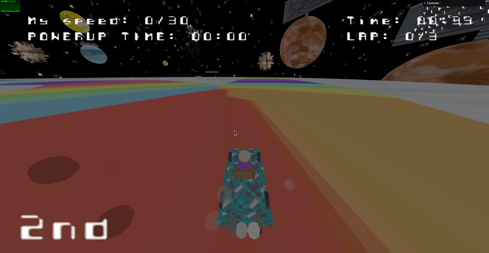

# SGI 2023/2024 - TP3

## Group T07G03

| Name            | Number    | E-Mail                   |
| --------------- | --------- | ------------------------ |
| Fábio Sá        | 202007658 | up202007658@edu.fe.up.pt |
| Marcos Ferreira | 201800177 | up201800177@edu.fe.up.pt |

---

## Project Information

Our project was to develop car racing game using THREE.js. We used the parser and XML pecification made to  model the required objects and scenes.

The primary inspiration for our game was drawn from the Mario Kart on the Nintendo 64, with aim to make a low polygon game from the Sega Saturn era. The result is a simple but fun kart racing game, featuring a track reminiscent (though not identical) to the famous Rainbow Road from Mario Kart.


Additional images can be found below.

## Topics

#### Game Requisites

- [Game Elements](#game-elements)
    - [Basic](#basic)
    - [Cars](#cars)
    - [PowerUps](#powerUps)
    - [Obstacles](#obstacles)
    - [Outdoors](#outdoors)
    - [Scenario](#scenario)
- [Techniques](#techniques)
    - [Picking](#picking)
    - [Keyframe Animation](#keyframe-animation)
    - [Collision Detection](#collision-detetion)
    - [Text and Spritesheets](#text-sprites)
    - [Shaders](#shaders)
    - [Particles](#particles)
- [Interactions](#interactions)
    - [Initial](#initial)
    - [Running](#running)
    - [End](#end)

#### Code Organization

- [Animations](#animations)
- [Loaders](#objects)
    - They are from the previous project, as such to make the readMe more compact will not be added.
- [Objects](#objects)
    - [Button](#button)
    - [Kart](#kart)
    - [Firework](#firework)
    - [Obstacle](#obstacle)
    - [Outdoor](#outdoor)
    - [Particle](#particle)
    - [Polygon](#polygon)
    - [PowerUp](#powerUp)
    - [Road](#road)
    - [Route](#route)
    - [SceneObject](#scene-object)
    - [Triangle](#triangle)
- [Shaders](#shaders)
- [Utils](#utils)
    - [Sprites](#sprites)
    - [TextDisplay](#text-display)
- [GameConfig](#game-config)
- [HUD](#hud)

#### Others

- [Example Photos](#example-photos)

## Game Requisites

<a id="game-elements"></a>
### 1. Game Elements

<a id="basic"></a>
#### 1. Basics

The game centers around the user's car and a computer-controlled car competing on a track with power-ups and obstacles. Our implementation this structure:

To better organize the code, we decided to move and rename some files that would better suit the game. Also, some of the files were created by extending `/objects/SceneObject.js` since many functionalities had common elements.

1. MyContents: remains as MyContents in the main folder
2. MyTrack: `objects/Road.js`


3. MyRoute: `objects/Route.js`

Routes are predefined for the computer to follow to simulate that it is racing against the player. In our case it make the car drive around the track, but the functionalities of detecting laps, passing through checkpoints are calculated exactly the same as the user's car, there is not difference in how they interact with the world (following guidelines that computer is not affected by powerups and obstacles).

4. MyObstacle: `objects/Obstacle.js`


5. MyPowerUp: `objects/PowerUp.js`


6. MyVehicle: `objects/Cart.js`

The objects are instantiated using the XML file. All the objects in the scene (with the exception of the text, which is created using `textDisplayUtils`) are already placed in the world accordingly, and the objects just need to be aware of each other, which is done by getting them using their IDs.

<a id="cars"></a>

#### 2. Cars

To comply with the guidelines the cars  as controlled using "WASD" keys on the keyboars. Since it was not tigthly specified, to keep the car moving the "W" of "S" key must remain pressed (moving foward or backwards respectively). It the key stop being pressed the car will slowly decelerated.

The acceleration and deceleration are not instantanenous, instead, it happens in a gradual shift, this allows the player to better control the speed of the car, and allows for better turning.

The wheels of the car also rotate according to the car's speed and it turns to signify that the car is turning.

The turning of the car is only made when the car is moving, however the wheels will turn if the "A" or "D" is being pressed.

The maximum speed of the car and its actual speed can be visualized in the hud and hud outdoor during gameplay.


<a id="powerUps"></a>

#### 3. PowerUps

In the game there are two types of powerUps:

1. Double the car's maximum speed during five seconds (configurable in the gameContents if changed directly in the file, there is no config for it in the game configurations), this is reflected on the HUD and the HUDOutdoor, also a time life for the effect is shown to the player.

2. Adding an obstable to the track. When the player gets this powerUp the game is automatically paused and allows the player to select an obstacle and where to place it in the track before returning the player to the game player.

<a id="obstacles"></a>

#### 4. Obstacles

In the game there are two types of obstacles:

1. Reduce the car's speed to 70% of the maximum speed during 5 seconds (configurable but not in a GUI during the game). This can be applied when the speed powerUp is active, meaning if a car's speed is 10, but a power makes it 20, the obstacle will make it 14.

2. Adding 5 seconds to the total time. It does not add 5 seconds to the player's timer but the whole game timer. If a player already won its time wont change since it is fixed to the completion of the time, meaning it does not affect his victory. 

<a id="outdoors"></a>

#### 5. Outdoors

An outdoor in the format of an island is provided in the scene, and it is kept updated with the latest information according to what is requested. Also, when a player pauses the game this is what is shown to him until he unpauses or gives up the race (in which he will go back to the main menu).


<a id="scenario"></a>

#### 6. Scenario

Like mentioned before, the inspiration of the scenario was the Rainbow Road from Mario kart in the Nintendo64 and the inspiration was to make a low polygon style from the Sega Saturn back in the 90s. As such we designed a spece like scene with the outdoors as planets or other space objects. 


ParkingLots are make as flying objects and so are the other objects required.


Above is an example of a parking lot, but there are the three required parking lots, them being:

- User's car choices
- Computer's car choices
- Selectable obstacle choices

<a id="techniques"></a>
### 2. Techniques

<a id="picking"></a>
#### 1. Picking

Picking was made and utilized in the following occasions:

- Buttons functionalities in the different menus
- Selecting cars for user and computer 
- Selecting obstacles to place and where to place them

To allow for this each object extends the SceneObject that implements logic to handle the picking, where the game logic can use the information to perform the necessary actions. An array of SceneObjects is used by the RayCaster to pick up the first object intersecting with the cursor, meaning the closest object from the observer's point of view.

<a id="keyfame-animation"></a>
#### 2. Keyframe Animation

Animation can be a property of a SceneObject if the XML contains control points with associated coordinates and times. In the project, key frames were used to:

- Animate the bot car, including aspects like speed, movement, and rotation.
- Animate objects in the scene, such as obstacles and power-ups, giving them movement.

The animation of an object is made by moving it along a predefined path defined by a set of `animation points`.

We made a `Animation.js` class, which is instaciated with an objects as an arguments (the object which will be animated) and an potional parameter that also allow for rotation.

The constructor extracts the objects position check for animations points and initializes the animation if points are available. if points exits, it initializes the animation by reating a series of keyframes. 

The keyframes are used to generate a `VectorKeyFrameTrack` that represents the animation of the object's position over time. An animation clip is also created to encapsulate this track.

During each frame update, it advances the animation using the elapsed time since the last frame. Additionally, if the animation involver rotation, the method calculates the angles between the old and new position of the objects, which is then used to adjust the object's new rotation.

Animation can be controlled using the methods `play` and `stop`.

<a id="collision-detection"></a>
#### 3. Collision Detection

The collision detection is made in the karts' code. Each object has a 'limit' attribute calculated based on the maximum length of all its constituents during the group construction through XML. This helps avoid adding a new element to the scene, which would be a bounding sphere for each object.
It handles 4 types of collisions:

1. Obstacles collision

This iterates throw an array of obstacles in the track. <br>
For each obstacle it calculates the distance between the kart and the obstacle using Three.js `distanceTo` method. <br>
If the calculated distance is less or equal to the sum of their repective size limits it detects a collision.
Alhough it also accounts for an obstacle cooldown so as not to activete multiple times since the car collising with an obstacle happens more than one time when they touch (because of the frequency of the update funtion).

2. PowerUp collision

The idea of the powerUp collision is same as the obstacles, and its logic works in the same way.

3. Car collision

The car collision checks if the calculated distance between the user's car and the computer's car if less or equal to the sum of their respective size limits. when this happens a collision is detected.

4. Out of road

To verify if a car is out of the road we check if the car is whithin boundaries utilizing the "has" method in road.js. If an "out of the road" is detected it sets a flag in the car which is used later to change the speed as required.

For efficiency reasons, out-of-road detection is handled differently. The two nearest control points on the road to the car (P1, P2) are used to determine a third point (P3). P3 is the point on the line segment P1-P2 closest to the car. The distance to the center of the road is given by the distance between the car and P3. The car is considered within the road if this distance is less than or equal to the road width. The algorithm has a complexity of O(N), where N is the number of control points on the track, and efficiency is ensured by using explicit methods of THREE.Vector3 which are inherently efficient.

<a id="text-sprites"></a>
#### 4. Text and Spritesheets

To allow for text using sprites 2 things were made:

1. A `SpriteUtils` that can receive textures (so not no keep loading the same texture and degrade performance). It willcopy the texture cut it using the received initial and final UVs and return the material.

2. A `TextDisplayUtils` which contains a group that stores sprites and position them like a line so that text can be written.

To allow for better performance the spritesheet will be stored in the `TextDisplayUtils` and will only be loaded again if needed. Another optimization made was storing the know letters in cache, so if we need to load new text/update text we can skip creating the sprite if it already exists. 

We do not load everything in the start, however as new letter sprites are needed they are created and stored in cache to prevent repeating the same operations and decreased performance.

<a id="shaders"></a>
#### 5. Shaders

Shaders were used to:

- Change the radial size of obstacles in the scene based on the elapsed time;


- Add relief to the obstacles in the scene;


- Construct a billboard that represents the current scene in bas-relief;


The shader utilizes `.vert` and `.frag` files to define the transformation of the vertices and the appearance of the pixels. The class `Shader.js` handles loading and storage of both vertex and fragments shaders.

<a id="particles"></a>
#### 6. Particles

The particle system was integrated into the project for:

- The car's exhaust emitting smoke particles;


- Fireworks, both at the start/finish line and in the end-of-game menu.


`Particle.js` deals with the logic behind it.

When a particle is instantiated, it is initialized with a position, color, speed, and random direction. Then, a destination point is set up, and a Three.js mesh is created for it.

The particle is then updated using linear interpolation using `position += (destination - position) / speed` to calculate its next position, also the particle's opacity slowly decreases.

Randomization is an important part of the particle behavior, random values are used to introduce and add diversity to the particles' initial position and movement.


When the particle's opacity reaches zero, we remove the particle from the scene, and, in the case of Fireworks, add more particles.

<a id="interactions"></a>
### 3. Interactions

<a id="initial"></a>
#### 1. Initial (Main menu)

The main menu is set up with a billboard serving as the menu, using text sprites to display necessary information. It also allows for project-specific configurations.

And allows for the configuration required by the project.


Changing the username is straightforward: click 'change name,' input the new name, and hit ENTER.

For difficulty, choose a value from 1 to 3.

Specify the number of laps within the range of 3 to 20.

Players can go to their respective parking lots by clicking `user car` or `bot car`, select a car, and return to the main menu with the chosen car.

Only after this car selection can players effectively click the `play` button. Trying to do so earlier will have no effect if essential information is missing.

<a id="running"></a>
#### 2. Running (gamePlay)

As previously noted, players can navigate during gameplay using "WASD" keys, with the added functionality of using the SPACE bar to pause the game.

During the pause, the HUDOutdoor becomes visible, and players can press SPACE to resume the game or ESC to exit and return to the main menu.

Additionally, there is an option to access the parking lot for obstacles. When a player acquires a power-up that enables this feature, they can select and place obstacles in the game.


<a id="end"></a>
#### 3. End (End menu)

The end menu provides a comprehensive summary of the race, enhancing the celebratory atmosphere with festive fireworks celebrating the winner's victory.


This display includes two interactive buttons for players:

- Play Again
- Go to Main Menu

Within this state, race results are presented through a well-organized display, featuring:

- Difficulty Level Used
- Cars Used:
  - Total Player Time
  - Total Time of the Opposing Car
  - Indication of Winning Player
  - Losing Player Indication

This detailed presentation ensures that players are well-informed about the race outcomes and adds an enjoyable visual element to celebrate the winner's success.


## Code Organization

The project's codebase is organized into various directories and modules to maintain clarity and facilitate efficient development. Key components include:

- **animations**: Contains the `Animation.js` module for handling keyframe animations.
- **loaders**: Features modules such as `CameraLoader.js`, `LightLoader.js`, and others responsible for loading different elements.
- **objects**: Holds modules defining essential game objects like buttons, carts, obstacles, power-ups, and more.
- **parser**: Includes modules like `MyFileReader.js` and `MySceneData.js` for parsing and handling scene-related data.
- **scene**: Encompasses the scene-related resources, including XML files, textures, and skybox images.
- **shaders**: Contains vertex and fragment shader files (`blow-up.frag`, `blow-up.vert`, `outdoor.frag`, `outdoor.vert`) along with the `Shader.js` module.
- **utils**: Houses utility modules like `CurveUtils.js`, `ShadowUtils.js`, `spriteUtils.js`, and others for miscellaneous functionalities.

Additional crucial files include `GameConfig.js` for game configurations, `HUD.js` for the heads-up display, and `MyApp.js` as the main application file. The project structure is visually depicted below:

```plaintext
.
├── animations
│   └── Animation.js
├── GameConfig.js
├── HUD.js
├── images
│   ...
├── index.html
├── loaders
│   ├── CameraLoader.js
│   ├── LightLoader.js
│   ├── MaterialLoader.js
│   ├── ObjectLoader.js
│   ├── SkyboxLoader.js
│   └── TextureLoaderC.js
├── main.js
├── MyApp.js
├── MyAxis.js
├── MyContents.js
├── MyGuiInterface.js
├── objects
│   ├── Button.js
│   ├── Cart.js
│   ├── Firework.js
│   ├── Obstacle.js
│   ├── Outdoor.js
│   ├── Particle.js
│   ├── Polygon.js
│   ├── PowerUp.js
│   ├── Road.js
│   ├── Route.js
│   ├── SceneObject.js
│   └── Triangle.js
├── parser
│   ├── MyFileReader.js
│   └── MySceneData.js
├── scene
│   ...
├── shaders
│   ├── blow-up.frag
│   ├── blow-up.vert
│   ├── outdoor.frag
│   ├── outdoor.vert
│   └── Shader.js
└── utils
    ├── CurveUtils.js
    ├── NurbsBuilder.js
    ├── NurbSurfaceUtils.js
    ├── ShadowUtils.js
    ├── spriteUtils.js
    └── TextDisplayUtils.js
```

<a id="scene-object"></a>
#### SceneObject

The SceneObject class is an impotant class. It acts as a base object from which other elements can derive. This class provides essential functionalities for handling and interacting with various objects within the scene.

A material ID and an existing object (obj) can be provided, which is used for some derived objects.

The calculateLimit determines the size limits of the object based on child meshes (which is used to calculate collisions).

Important functionalities are: animation management, object movement control, picking enable and disable, object selection and deselection, and interaction state tracking. Additionally, the class supports the traversal of the object, enabling the retrieval of specific sub-objects based on their names.

<a id="animations"></a>
### Animation

The `Animation` class handles the animation of objects, supporting translation and rotation. The constructor initializes animation parameters, and if animation points are provided, it sets up keyframes, a clip, and a mixer. The angle method calculates the angle between two three-dimensional positions. The update method progresses the animation based on elapsed time, handling rotation if specified. Additionally, methods to stop and play the animation are included.

<a id="objects"></a>
### Objects

<a id="button"></a>
#### Button

The `Button` class derives from the base SceneObject class. The constructor initializes a button object associated with a given scene object. The update method manages the button's state, adjusting its color based on pickability. Methods like play and stop control the button's motion. Additionally, the class provides functionality to set visibility properties for materials and toggle the button between visible and invisible states.

<a id="kart"></a>
#### Kart

The `Cart` is extension of the `SceneObject` to represent a cart. The constructor initializes  the properties cart's position, orientation, speed, and various race-related attributes. It also establishes relationships with other game elements, such as obstacles, power-ups, and an opponent cart.

The `setConfig` method configures settings for the cart based on the provided configuration object. The `setRoute` method establishes a predefined route for an autonomous cart, while `setCamera` associates a camera with the cart.

The cart's motion is controlled through methods like `accelerate`, `decelerate`, and `turn`, responding to user input. The `update` method handles acceleration, deceleration, collision detection with obstacles and power-ups, updates the cart's position, and manages smoke particle effects.

Race-specific functionalities are also implemented, such as setting a predefined route for autonomous carts and handling lap completion. The `nextControlPoint` method ensures the cart progresses through checkpoints during a race, updating lap counts accordingly.

The `Cart` class manages penalties and power-ups. When encountering obstacles or power-ups, it adjusts the cart's speed and applies the penalties or rewards. 

The `verifyEndRace` method checks if the cart has completed the required laps and, if so, records the race time.

<a id="firework"></a>
#### Fireworks

The `Firework` class extends the base class SceneObject and serves as a representation of a firework. This class is responsible for managing the playback of the firework, creating and updating particle effects to simulate a firework display. The play method initiates the firework's playback, the pause method halts the playback, and the update method continuously adds new particles to imitate sparks. In the event of a completed firework particle display, the class can trigger an explosion effect by generating additional particles, enhancing the overall visual experience. In summary, the Firework class encapsulates the functionality needed for orchestrating and animating a firework display within our specific project.

<a id="obstale"></a>
#### Obstacle

The `Obstacle` class manages the obstacles. When instantiating an obstacle, its type is specified, and its initial position is configured. The obstacle has the capability to undergo transformations over time and use permanent obstacles user shaders to change their visual.

For user selectable obstacles there are functions to:

- Select and pick the obstacle
- Place the obstacle ath in the correct parking lot

<a id="outooor"></a>
#### Outdoor

The `Outdoor` class  manages the displays and menus. It extends the SceneObject class and encapsulates functionalities for handling a writable outdoor space. When creating an instance of Outdoor, we can specify the size of the writable area along the X and Y axes, as well as the distance of text from the outdoors (so as not to have overlapping text with the outdoor object).

It provides functions for adding text to the outdoor space at specified positions. The addText method allows for incorporating content with customization options such as letter size and spacing.

Moreover, the Outdoor class features the ability to update text dynamically. The updateText method lets us modify the content of a specific text element identified by its index.

<a id="particle"></a>
#### Particle

The `Particle` deals with the representation of individual particles. It extends the base SceneObject class, and manages creation, movement, and lifecycle of particles. It allows for customization of parameters such as position, level, speed, and color. Each particle is launched with specific initial conditions, and the update method handles its movement, adjusting opacity, and managing its lifecycle. Methods to reset the particle, retrieve its position, and obtain its level are provided. 

<a id="powerUp"></a>
#### PowerUp

The `PowerUp` class, an extension of the base `SceneObject` class, represents power-ups in our project. These power-ups, associated with specific objects, are defined by their type. The class incorporates a cooldown functionality as to not allow the player to gather many powerUps and prevent the game from working fairly or breaking it. `update` manages animation updates and adjusts the cooldown timer, while the `animate` method initiates object animations.

<a id="road"></a>
#### Road

The `Road` is an extension of the SceneObject. It includes functionality to check whether a given object is within the bounds of the road (which is used to check if the car is in the road), obtain the original control points of the road, and verify road selection (to place obstacles). The `has` determines if an object is within the road bounds based on its distance to the control points, considering the road width. The getPoints method retrieves the original control points of the road.

<a id="route"></a>
#### Route

The `route` is an extension of SceneObject. It is responsible for managing the routes the computer uses to automatically move the car around the track. The calculateLimit method is employed to determine the operational limits of the route.

<a id="shaders"></a>
### Shaders

The `Shader` serves as a wrapper for handling vertex and fragment shaders. It allows for the asynchronous loading of shader files, subsequently constructing a `ShaderMaterial` with specified uniform values. This simplifies the integration of custom shaders into the game.
    
<a id="utils"></a>
### Utils

<a id="sprites"></a>
#### Sprites

The `spriteCreator` facilitates the creation and manipulation of Three.js sprites in our project. It offers functions for loading sprites with specified textures, positions, and sizes (loadSprite), updating sprite positions based on the camera's view (updateSpritePosition), and modifying sprite textures dynamically (updateSprite). These functionalities enhance the management and customization of sprites within our Three.js application.


<a id="text-display"></a>
#### TextDisplay

The `textDisplayHelper` module manages and displays text in a the game. It provides functionality for initializing letter mappings, retrieving letter sprites, creating text groups, and updating text within the scene. The module uses a spritesheet for character textures and caches letter sprites to avoid redundant loading. It enhances the flexibility by incorporating dynamic text elements, allowing for easy manipulation and updates.
    
<a id="game-config"></a>
### GameConfig

This is a simple file that servers as a configuration file for the game, it also allows use to set information that should be known accros multiple files.

<a id="hud"></a>
### hud

The `HUD` creates a heads p display for the game that stays in the camera view appearing as static. It maintains a list of text elements to be displayed as information to the player. Additionally, it provides methods for adding text elements, updating text content at specified indices, and dynamically adjusting the position of text elements based on the camera and renderer.


<a id="example-photos"></a>
## Images





